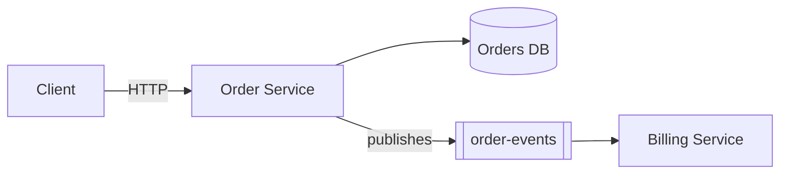

# code-map

[](LICENSE)
[](https://claude.com/claude-code)

**Turn an unfamiliar codebase into a usable mental model in minutes.**

Point it at any repo. Get a single, navigable Markdown map of the codebase — architecture, key flows, data model, dependencies, entry points, and exactly where each piece lives in the code. Go from “What is this?” to “I know where to look.”

`code-map` is a [Claude Code](https://claude.com/claude-code) skill that turns "what does this repo do?" into a single `.md` file: a design overview, tech stack, a mermaid architecture diagram, sequence diagrams read straight out of the source, an ERD when database entities exist, and a module-responsibility-path table.

The output renders natively on GitHub, IntelliJ and Confluence — no HTML, no publish step, no build tooling required to view it. This is a code map, not a design document: real file paths and type names are expected and encouraged, so the reader can jump straight from the map into the source.

## Why

- **Onboarding** — a new engineer gets oriented in minutes instead of days of spelunking.
- **Handoffs and audits** — a living artifact that diffs alongside the code, instead of a wiki page that rots.
- **Zero setup** — markdown out, nothing to host, no viewer to install.
- **Cost-aware by design** — a scripted inventory runs first and answers most of the map; the LLM only spends effort filling genuine gaps.
- **A single-file project knowledge base** — one markdown file Claude can load wholesale for code analysis or quick questions about the repo, instead of re-exploring the codebase from scratch each time.

## What it produces

| Section | What you get |
|---|---|
| **Business summary** | What the service does, in plain language, for a non-engineer reader |
| **High-level architecture** | A mermaid `flowchart` of the service, its callers, dependencies and stores |
| **Key flows** | 2-3 mermaid `sequenceDiagram`s for the important call paths, including error branches |
| **Data model** | A mermaid `erDiagram`, only when entities or migrations exist in the repo |
| **Module guide** | A table mapping each module/package to its responsibility and path |
| **Entry points & tech stack** | Endpoints, listeners, schedulers, and technologies with real versions |
| **Risks & known issues** | TODO/FIXME clusters, swallowed exceptions, disabled tests — each with a consequence, not just a location |
| **Contacts & source** | Owning team, remote, branch, commit SHA, and an explicit **Not determined** callout for anything unverifiable |

Every load-bearing claim in the map traces back to a file the skill actually read. Unverified statements are labelled as such rather than guessed — never silently assumed.

### A taste of the output

The architecture and flow diagrams are real mermaid, generated from your source — here's the shape of what lands in the map:



## Installation

Claude Code loads personal skills from `~/.claude/skills/<name>/`. Clone this repo directly into that location:

```bash
git clone https://github.com/stack-muse/code-map.git ~/.claude/skills/code-map
```

Restart Claude Code (or start a new session) and the skill will be available.

## Usage

Inside a Claude Code session, in or pointed at the repo you want mapped:

```
/code-map
/code-map path/to/repo
/code-map https://github.com/org/repo.git
/code-map --artifact
```

You can also just describe what you want in plain language — e.g. "map this repo", "give me a sequence diagram for the order service", "what does this jar do" — and Claude Code will trigger the skill.

On first run it asks once, up front, about scope (this repo only vs. related repos too), whether to also publish the map as a shareable artifact page, and where to save the file (defaults to `docs/code-map.md` in the target repo).

## How it works

1. **Inventory** (`assets/`) — a fast, scripted, read-only scan of the target repo: provenance, size, tech stack and versions, config shape, entry points, scheduling/messaging, entities/migrations, API specs, outbound clients, common framework pitfalls, test posture and ownership. This runs before any LLM reasoning, so the expensive part of the process only fills genuine gaps.
2. **Targeted reading** — the skill traces 2-3 end-to-end flows through the call path by reading source directly. Small repos (under ~10k lines) get no subagents at all; larger ones get at most two, each scoped to one deployable.
3. **Write** — a fixed section order (see above), with mermaid diagrams validated against known rendering pitfalls before the file is saved.
4. **Optional publish** (`--artifact`) — renders the finished markdown as a shareable page, only when explicitly requested.

See [`SKILL.md`](SKILL.md) for the full, detailed instructions the skill follows, and [`references/source-ingestion.md`](references/source-ingestion.md) for how it handles multi-repo landscapes and packaged artifacts (jar/war/zip/etc.) instead of a plain local checkout.

## Repo layout

```
code-map/
├── SKILL.md                        # the skill's full instructions
├── assets/
│   ├── inventory.sh                 # scripted, read-only repo scan
│   └── usage.sh                     # token usage / cost estimate for a run
└── references/
    └── source-ingestion.md          # multi-repo & packaged-artifact handling
```

## Contributing

Issues and pull requests are welcome — if you use this on a stack it doesn't handle well yet (a framework the inventory script doesn't recognize, a diagram type that doesn't render), open an issue with an example.

## License

[MIT](LICENSE)
