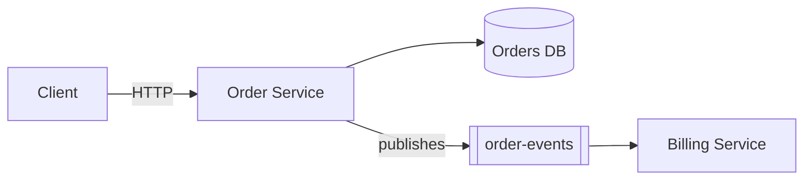

# code-map

[](LICENSE)
[](https://claude.com/claude-code)
[](https://developers.openai.com/codex/skills)
[](https://cursor.com/docs/skills)

**Turn an unfamiliar codebase into a usable mental model in minutes.**

Point it at any repo. Get a single, navigable Markdown map of the codebase — architecture, key flows, data model, dependencies, entry points, and exactly where each piece lives in the code. Go from “What is this?” to “I know where to look.”

`code-map` is an [Agent Skill](https://agentskills.io) for [Claude Code](https://claude.com/claude-code), [Codex](https://developers.openai.com/codex/skills) and [Cursor](https://cursor.com/docs/skills) that turns "what does this repo do?" into a single `.md` file: a design overview, tech stack, a mermaid architecture diagram, sequence diagrams read straight out of the source, an ERD when database entities exist, and a module-responsibility-path table.

The output renders natively on GitHub, IntelliJ and Confluence — no HTML, no publish step, no build tooling required to view it. This is a code map, not a design document: real file paths and type names are expected and encouraged, so the reader can jump straight from the map into the source.

## Why

- **Onboarding** — a new engineer gets oriented in minutes instead of days of spelunking.
- **Handoffs and audits** — a living artifact that diffs alongside the code, instead of a wiki page that rots.
- **Zero setup** — markdown out, nothing to host, no viewer to install.
- **Cost-aware by design** — a scripted inventory runs first and answers most of the map; the LLM only spends effort filling genuine gaps.
- **A single-file project knowledge base** — one markdown file your agent can load wholesale for code analysis or quick questions about the repo, instead of re-exploring the codebase from scratch each time.

## What it produces

| Section | What you get |
|---|---|
| **Business summary** | What the service does, in plain language, for a non-engineer reader |
| **High-level architecture** | A mermaid `flowchart` of the service, its callers, dependencies and stores |
| **Key flows** | 2-3 mermaid `sequenceDiagram`s for the important call paths, including error branches |
| **Data model** | A mermaid `erDiagram`, only when entities or migrations exist in the repo |
| **Module guide** | A table mapping each module/package to its responsibility and path |
| **Entry points & tech stack** | Endpoints, listeners, schedulers, and technologies with real versions |
| **Risks & known issues** | TODO/FIXME clusters, swallowed exceptions, disabled tests — each with a consequence, not just a location |
| **Contacts & source** | Owning team, remote, branch, commit SHA, and an explicit **Not determined** callout for anything unverifiable |

Every load-bearing claim in the map traces back to a file the skill actually read. Unverified statements are labelled as such rather than guessed — never silently assumed.

### A taste of the output

The architecture and flow diagrams are real mermaid, generated from your source — here's the shape of what lands in the map:



## Installation

Clone the repo anywhere, then run `install.sh` for the agent(s) you use:

```bash
git clone https://github.com/stack-muse/code-map.git
cd code-map
./install.sh claude     # Claude Code     -> ~/.claude/skills/code-map
./install.sh codex      # Codex + Cursor  -> ~/.agents/skills/code-map
./install.sh cursor     # same as codex
./install.sh all        # both of the above
```

Codex and Cursor both read the shared Agent Skills folder `~/.agents/skills`, so they share one install (`adapters/agents/`); `codex` and `cursor` are just friendlier names for it. Claude Code gets its own (`adapters/claude/`). Each install is the same shape: that adapter's `SKILL.md` plus the shared `assets/` and `references/`. Start a new session in your agent afterwards to pick up the skill.

> **Cursor and Claude Code together:** Cursor also reads `~/.claude/skills`, so with both installed it lists two `code-map` skills. The Claude Code copy relies on Claude-only tools, so in Cursor use the other one. To avoid the duplicate, install the Claude copy per project with `./install.sh claude --project <repo>`.

| Option | What it does |
|---|---|
| `--link` | Symlink instead of copy, so `git pull` in your checkout updates the skill without reinstalling |
| `--project <dir>` | Install for one repo only, into `<dir>/.claude/skills` (Claude Code) or `<dir>/.agents/skills` (Codex, Cursor) |

Re-running `install.sh` is safe; it replaces only the files it installed.

### Upgrading from the single-skill clone

Earlier versions were installed by cloning straight into `~/.claude/skills/code-map`. That layout no longer loads, because `SKILL.md` now lives under `adapters/`. Remove the old clone and install again:

```bash
rm -rf ~/.claude/skills/code-map
./install.sh claude
```

`install.sh` detects the old clone and prints this command rather than overwriting it.

## Usage

In or pointed at the repo you want mapped:

| Agent | How to run it |
|---|---|
| Claude Code | `/code-map`, `/code-map path/to/repo`, `/code-map https://github.com/org/repo.git`, `/code-map --artifact` |
| Codex | `$code-map`, or pick it from `/skills` |
| Cursor | `/code-map` in Agent chat |

You can also just describe what you want in plain language — e.g. "map this repo", "give me a sequence diagram for the order service", "what does this jar do" — and the agent will trigger the skill.

On first run it asks once, up front, about scope (this repo only vs. related repos too) and where to save the file (defaults to `docs/code-map.md` in the target repo). Claude Code also asks whether to publish the map as a shareable artifact page.

### What differs per agent

The method, sections and output are the same everywhere. The agent-specific parts are:

| | Claude Code | Codex | Cursor |
|---|---|---|---|
| Up-front questions | Structured question prompt | One chat message, you reply | One chat message, you reply |
| Subagents on large repos (>10k lines) | Up to 2 (Sonnet) | None | Up to 2 |
| `--artifact` shareable page | Yes | No | No |
| Run cost report | Tokens and estimated USD | Tokens (not priced) | Not available |

## How it works

1. **Inventory** (`assets/inventory.sh`) — a fast, scripted, read-only scan of the target repo: provenance, size, tech stack and versions, config shape, entry points, scheduling/messaging, entities/migrations, API specs, outbound clients, common framework pitfalls, test posture and ownership. This runs before any LLM reasoning, so the expensive part of the process only fills genuine gaps.
2. **Targeted reading** — the skill traces 2-3 end-to-end flows through the call path by reading source directly. Small repos (under ~10k lines) get no subagents at all; larger ones get at most two where the agent supports them, each scoped to one deployable.
3. **Write** — a fixed section order (see above), with mermaid diagrams validated against known rendering pitfalls before the file is saved.
4. **Optional publish** (Claude Code, `--artifact`) — renders the finished markdown as a shareable page, only when explicitly requested.

The shared method lives in [`references/workflow.md`](references/workflow.md); each [`adapters/<adapter>/SKILL.md`](adapters/) adds only how that agent asks questions, uses subagents and reports cost. See [`references/source-ingestion.md`](references/source-ingestion.md) for how it handles multi-repo landscapes and packaged artifacts (jar/war/zip/etc.) instead of a plain local checkout.

## Repo layout

```
code-map/
├── install.sh                       # installs the skill for claude | codex | cursor | all
├── adapters/
│   ├── claude/SKILL.md              # Claude Code: question prompt, Explore agents, --artifact, cost
│   └── agents/SKILL.md              # Codex, Cursor & other Agent Skills hosts: chat questions, cost
├── assets/
│   ├── inventory.sh                 # scripted, read-only repo scan (shared)
│   └── usage.sh                     # token usage / cost estimate (--agent claude|codex|cursor)
└── references/
    ├── workflow.md                  # the shared method every adapter follows
    └── source-ingestion.md          # multi-repo & packaged-artifact handling
```

## Contributing

Issues and pull requests are welcome — if you use this on a stack or agent it doesn't handle well yet (a framework the inventory script doesn't recognize, a diagram type that doesn't render), open an issue with an example.

## License

[MIT](LICENSE)
